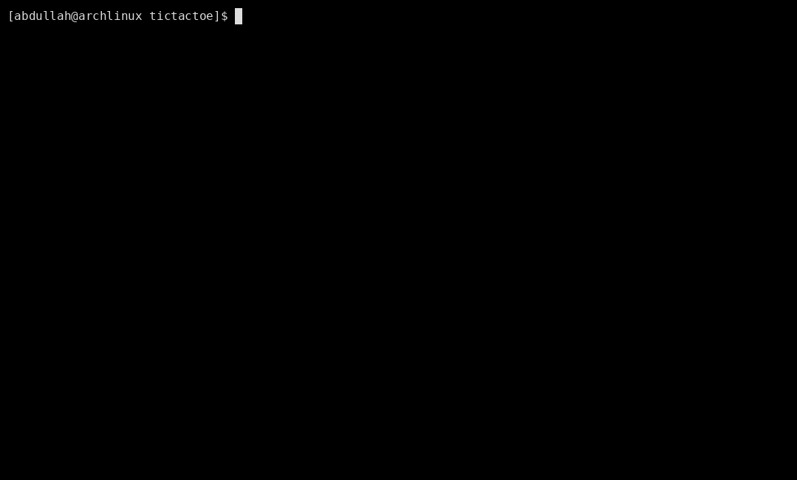

# Terminal Tic-Tac-Toe

A minimalist, raw-mode Tic-Tac-Toe engine written in pure C++. It features a cozy 256-color ANSI palette, responsive terminal UI layouts, and direct low-level keyboard input polling.

## Cross-Platform Support

This engine is available in two targeted versions depending on your operating system environment:

* **`tictactoe_lin.cpp`** – Designed for UNIX-like environments (Linux, macOS) utilizing low-level POSIX terminal configurations (`<termios.h>` and `<unistd.h>`).
* **`tictactoe_win.cpp`** – Designed natively for Windows environments (Command Prompt, PowerShell, Code::Blocks) utilizing the Windows console system interface (`<conio.h>`).

---

## Gameplay Demo


---

## How To Play

* Use your keyboard's **Arrow Keys** to glide the highlighted cursor across board slots.
* Press **Spacebar** or **Enter** to lock down a placement token.
* The engine automatically switches turns between Player `X` and Player `O`.
* Press **`q`** at any time to exit the terminal session cleanly.

---

## Compilation & Setup

Choose the correct command execution pathway for your target development platform below:

### 🐧 Linux / macOS

Open your terminal emulator and execute the standard GCC build commands:

```bash
g++ tictactoe_lin.cpp -o tictactoe
./tictactoe

```

### 🪟 Windows

You can load `tictactoe_win.cpp` directly into an IDE like **Code::Blocks** and hit **F9 (Build and Run)**, or compile it manually using the developer command prompt tool chain (MinGW):

```cmd
g++ tictactoe_win.cpp -o tictactoe.exe
tictactoe.exe

```
